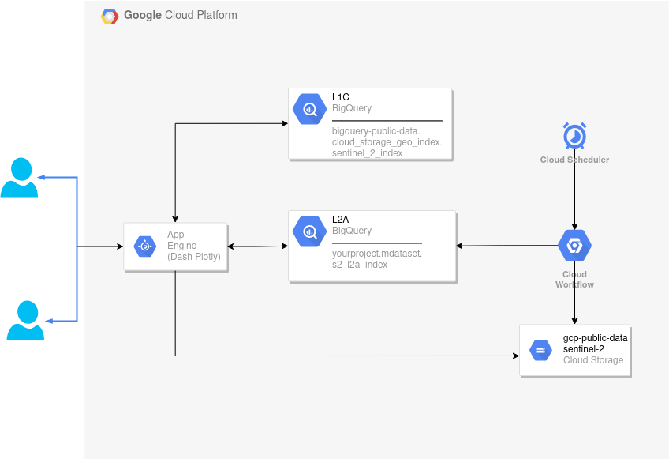
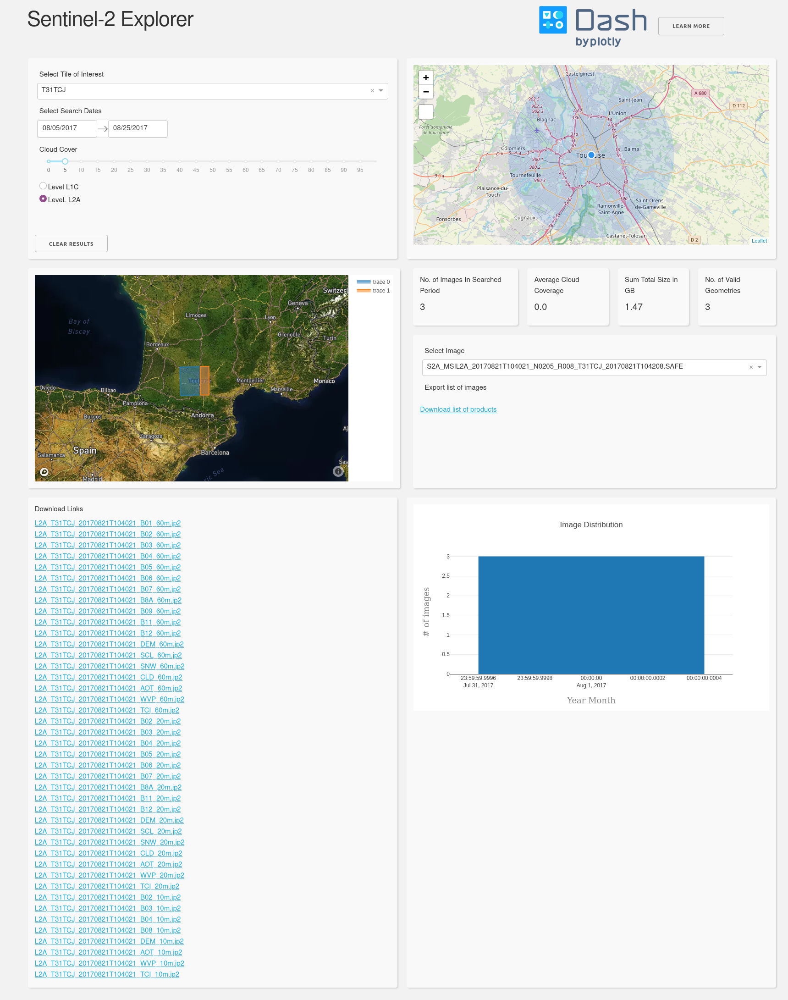
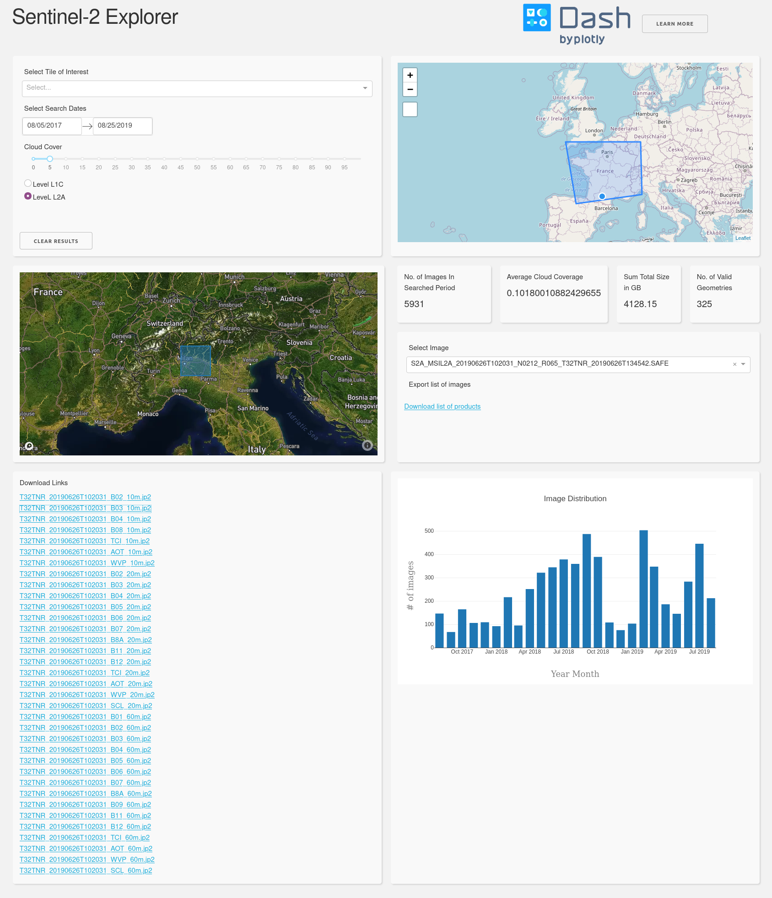

# Sentinel-2 Explorer

## Motivation

Sentinel-2 images are a great source of data for various remote sensing applications. However, the search for historical images has become quite complicated due to storage challenges, archiving of historical data, etc. Thanks to Google, these images are avaialble (in both processing levels) free of charge on Google Cloud Storage (GCS)[1](#google-sentinel) and are easy to download (espiecally level L1C as we will see later in the description of the project). This repository is the first step towards simplifying the access to these images and even the historical ones through a web application that enables downloading certain bands of interest directly or by downloading a list of products and using a helper python script to get them on a local machine. The main idea is to leave the heavy lifiting of data storage to Google and build the application using the power of BigQuery and other GCP services.

## Objectives

1. Provide a simple GCP architecture that allows accessing these images.

2. Provide tools and code snippets that allow manipulating Sentinel-2 products on the cloud using GCP services such as dataflow and hopefully integrating some AI services in the future.

## General Architecture

The application consists of 5 main components

1. **Frontend** implemented using Dash Plotly[2](#dash) and deployed on GCP using App Engine.

2. **Catalog** for L1C and L2A and hosted on BigQuery tables.

3. **Cloud Workflow** to ingest L2A catalog to BigQuery table as it is not available in Google Public Datasets.

4. **Cloud Scheduler** to systemically run the ingestion workflow.

5. **Cloud Storage** the source of Sentinel-2 products and catalogs.

## How it works

There are two scenarios to search for Sentinel-2 images (L1C or L2A). For L1C, the process is less complicated since the catalog of L1C products is available in the Google Public Datasets in BigQuery. So, no additional steps are needed besides querying the catalog table from BigQuery.\
However, for the L2A catalog it is not the case. The catalog is available as a Cloud Storage object as a compressed CSV. Please note that it is possible to query a CSV file stored in Cloud Storage in BigQuery. But this is not recommended as it has performance issues. Looking at the potential expansion of the Sentinel-2 catalog, this option was avoided. The alternative used here is to ingest the L2A catalog to BigQuery using Cloud Workflow. A Cloud Scheduler is then use to run the workflow systemically (the frequency can be configured as in crontab).\
So now, all the catalog are available to be queried by the user. Using a Web app developed in Dash Plotly, the user has the following options:

- Select a Sentinel-2 tile

- Draw an ROI using an interactive map

- Select the search period

- Select the cloud cover threshold

- Select the processing level

After the search is done, a list of found images appears in a dropdown list, where the user can select an image from this list, visualize its extent and download bands of interests. The user can also download the URLs of these images and use the helper [python script](./sentinel-google-download) to download the images locally as full products.\
Below, some screenshots of the Dash app to search for the images.

The first screenshot shows an example of image search using Sentinel-2 tiles. The second screenshot is an interesting example of how powerful BigQuery can be when processing a large dataset. On a search window of two years over all France, the app returns a total of around 6000 images that match the search criteria. Then, some statistics and insights are visualized from the searched images.

To dive into the details of each component, please refer to the README of each of them.

## Repo Content

Folder | Description
|--------|----------|
|[L2A catalog ingestion to BigQuery](./S2L2A_workflow)| A work flow to ingest L2A cattalog from GCS to BigQuery|
|[Dash App](./dash-app)| Web App to search and download Sentinel-2 images|
|[Python download functions](./sentinel-google-download)| Python scripts to download Sentinel-2 images from GCS or to download a list of products after search using the Dash app|
|[Dataflow for NDVI estimation](./dataflow)|An example of how dataflow can be used to perform calculation on Sentinel-2 images on the cloud|

## Prerequisites

- Basic knowledge in GCP.

- Python

- Basic knowledge BigQuery.

- Some knowledge in Sentinel-2 products and their metadata.
__________________________________________________________________
> Feel free to test, imporve or contribute. If you have further ideas to improve this, don't hesitate to contact me. I hope to gather here many examples of how to use remote sensing data on the cloud. I also thank the people who already shared their love to open source (see the [Inspiration](#insp) of this project).

___________________________________________________________

## References

<a name="google-sentinel">1</a> https://cloud.google.com/storage/docs/public-datasets/sentinel-2

<a name="dash">2</a> https://plotly.com/dash/

___________________________________________________________

 ## <a name="insp">Inspiration</a> 

1. https://gis.stackexchange.com/questions/293024/downloading-sentinel-2-data-from-google-cloud-storage-with-python

2. https://medium.com/codeshake/build-a-serverless-bigquery-ingestion-pipeline-using-cloud-workflows-f893f6b701ee

3. https://dash-gallery.plotly.host/dash-oil-and-gas/
